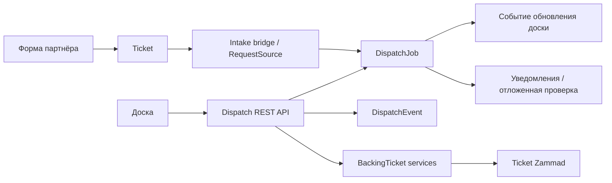

# Архитектура Дом-Сервиса

Срез реализации: cdc71a1bd8, проверено 2026-09-06.
Все относительные ссылки в этом разделе ведут в репозиторий приложения.

## Граница форка

Исходная точка Zammad — 46f0315f886c0b447ccac345908eca733fa81f73, 17 марта 2026.
В рассматриваемом develop над ней 55 коммитов, включая 7 merge-коммитов.
Большая часть репозитория — унаследованный Zammad; собственные изменения ищите по DomServis / dom_servis.

Два репозитория:

- [Приложение](https://github.com/koronamedia/Svib-Home-Service): Rails, UI, миграции, тесты, Dockerfile.
- [Runtime](https://github.com/koronamedia/Svib-Home-Service-docker-compose):
  Compose, сервисы, переменные окружения, скрипты запуска.

Ruby зафиксирован в [.ruby-version](../../.ruby-version), зависимости — в
[Gemfile.lock](../../Gemfile.lock) и [pnpm-lock.yaml](../../pnpm-lock.yaml).
[package.json](../../package.json) задаёт команды frontend и packageManager.
Не переносите версии зависимостей из памяти в обход этих файлов.

## Владение данными



| Объект | Ответственность |
| --- | --- |
| DispatchJob | Статус, исполнитель, планирование, адрес, услуга, теги, метаданные приёма, снимок клиента |
| DispatchEvent | История действий над заявкой |
| Ticket | Номер заявки, клиент, переписка; проекция операционных полей для инструментов Zammad |
| User / Role | Сотрудники и глобальные разрешения |
| Group | Доступ к тикетным очередям; не готовая территориальная фильтрация доски |
| Organization | Заказчик или партнёр; не основная граница доступа к заявке |
| RequestSource | Реестр источников приёма, токен, организация, домены, параметры embed |
| PushSubscription | Подписка устройства на Web Push |

DispatchJob — оперативный источник истины.
Проекция DispatchJob → Ticket выполняется выделенными сервисами.
Свободной двусторонней синхронизации нет.

### Правило владения полями

Каждое поле заявки записывается в одном месте; вторая сторона — только проекция.

| Данные | Владелец | Проекция |
| --- | --- | --- |
| Номер заявки для людей | Ticket.number | job_code — совместимость, новые функции на нём не строить |
| Идентичность клиента | Ticket.customer, Ticket.organization | снимок в DispatchJob |
| Переписка | статьи Ticket | — |
| Статус | DispatchJob.status | Ticket.state, dom_servis_dispatch_status |
| Мастер | DispatchJob.assignee | Ticket.owner, dom_servis_assignee_name |
| Дата, время, адрес, услуга, описание, источник, приоритет, комментарий диспетчера | DispatchJob | колонки dom_servis_* |

DispatchJob.id — внутренний технический идентификатор.

### Модель статусов

Статусы, переходы, требуемые действия политики и проекция в Ticket.state описаны в одном месте —
[DispatchWorkflow](../../app/models/dom_servis/dispatch_workflow.rb).
Модель DispatchJob проверяет переход и инвариант мастера при каждом сохранении.

```text
pool ──take/assign──▶ taken ──▶ in_progress ──▶ done ──close──▶ closed
taken | in_progress ──release──▶ pool
pool | taken | in_progress ──▶ cancelled | transferred_to_partner
done | closed | cancelled ──reopen──▶ pool
```

- done — мастер закончил работу на объекте; closed — диспетчер закрыл заявку после проверки.
- pool — мастера нет; taken, in_progress, done — мастер обязателен.
- Вход в taken — только через take/assign; transferred_to_partner — конечный статус.
- /status и generic update используют одну проверку перехода и действий политики.
- Ticket.state: pool → new; taken, in_progress, done → open; closed, cancelled, transferred_to_partner → closed.
- Миграция статуса closed переводит прежние done в closed. Если есть заявки, нарушающие инвариант мастера,
  она останавливается до изменений и перечисляет их id; такие данные исправляются отдельно, вручную.

## Основные потоки

### Ручное создание

[JobsController#create](../../app/controllers/dom_servis/dispatch/jobs_controller.rb)
проверяет права и теги, сохраняет заявку, записывает события и создаёт backing ticket в транзакции.
Не заменяйте этот сценарий голым DispatchJob.create!: вызов модели не воспроизводит весь workflow.

Создание всегда даёт заявку в pool без мастера: assignee_id, отметки времени жизненного цикла
и статус, отличный от pool, отклоняются с 422.

### Взятие и назначение

- take использует блокировку записи; при конфликте исполнителя возвращает 409; взять можно только заявку из pool.
- assign проверяет активного мастера; назначать можно в pool, taken и in_progress.
- release возвращает в pool только taken и in_progress; завершённые заявки возвращаются через reopen.
- Назначение из pool переводит в taken.
- Изменение исполнителя через generic update запрещено.
- После операции синхронизируются связанные сведения тикета.

Политики, controller guards и настройки поведения работают совместно.
UI-скрытие кнопки не является проверкой доступа.

### Приём с партнёрского сайта

FormController создаёт Ticket; TicketAdapter и DispatchJobCreator создают связанную заявку.
RequestSource разрешается по токену; организация берётся из серверного реестра.
Идентификатор организации с сайта партнёра не является доверенным источником.

Уникальность ticket_id предотвращает несколько заявок для одного тикета.
Для других входных каналов используется source_reference; его наличие само по себе
не гарантирует устранение всех конкурентных дублей.

Подробный контракт: [Partner Intake Registry](../dom-servis-partner-intake-registry.md).

### Realtime

DispatchJob после commit отправляет событие через PushMessages.
Доска получает сигнал и повторно читает REST-список.
Это invalidation + reload, а не поток полных записей.
При открытой форме обновление откладывается.

### Push

Callbacks модели выбирают получателей через Notifications::Dispatcher.
Внутреннее уведомление сохраняется в Zammad, Web Push ставится в фоновую очередь.
WebPushSender отправляет сообщение провайдеру браузера.
Service worker показывает системное уведомление и открывает доску.

DispatchEscalationJob проверяет, остаётся ли новая заявка в pool после задержки.
Это отдельный механизм от визуального предупреждения перед визитом.

## Карта кода

| Задача | Начать здесь |
| --- | --- |
| Карточки, фильтры, действия, realtime, push-кнопки | [dispatch_board.coffee](../../app/assets/javascripts/app/controllers/dom_servis/dispatch_board.coffee) |
| Разметка доски | [board.jst.eco](../../app/assets/javascripts/app/views/dom_servis_dispatch/board.jst.eco) |
| Оформление и mobile shell | [dom_servis_dispatch.css](../../app/assets/stylesheets/addons/dom_servis_dispatch.css) |
| Административный UI | [dispatch.coffee](../../app/assets/javascripts/app/controllers/dom_servis/dispatch.coffee) |
| Данные заявки | [dispatch_job.rb](../../app/models/dom_servis/dispatch_job.rb) |
| Статусы и переходы | [dispatch_workflow.rb](../../app/models/dom_servis/dispatch_workflow.rb) |
| Операции API | [jobs_controller.rb](../../app/controllers/dom_servis/dispatch/jobs_controller.rb) |
| Матрицы действий/полей | [dispatch_policy.rb](../../app/models/dom_servis/dispatch_policy.rb) |
| Доступ к записям | [dispatch_job_policy.rb](../../app/policies/dom_servis/dispatch_job_policy.rb) |
| Связь с тикетами | [backing_ticket](../../app/services/dom_servis/dispatch/backing_ticket/) |
| Приём обращений | [intake](../../app/services/dom_servis/intake/) |
| Реестр партнёров | [request_source.rb](../../app/models/dom_servis/request_source.rb) |
| Партнёрская форма | [embed HTML](../../public/assets/form/dom-servis-partner-embed.html) |
| Вложения | [attachments_controller.rb](../../app/controllers/dom_servis/dispatch/attachments_controller.rb) |
| PWA-оболочка | [dispatch_board_controller.rb](../../app/controllers/dispatch_board_controller.rb) |
| Service worker | [sw.js](../../public/assets/dispatch/sw.js) |
| Доставка уведомлений | [notifications](../../app/services/dom_servis/notifications/) |
| Проверка невзятой заявки | [dispatch_escalation_job.rb](../../app/jobs/dom_servis/dispatch_escalation_job.rb) |

## Интерфейсы и маршруты

| Маршрут | Назначение |
| --- | --- |
| /#dom_servis/dispatch | Основная доска |
| /#manage/dom_servis_dispatch | Настройки политики |
| /#manage/dom_servis_request_sources | Реестр источников |
| /dispatch/ | PWA, использующая общую доску |
| /dispatch/sw.js | Worker |
| /dispatch/manifest.webmanifest | Manifest |

Vue mobile-компонент существует, но его
[маршрут](../../app/frontend/apps/mobile/pages/dom-servis/routes.ts) перенаправляет на общую доску.
[Мобильная песочница](../../dom-servis-mobile-sandbox/README.md) работает с mock-данными.

## Правила изменения архитектуры

- Новые бизнес-модели и сервисы — в DomServis.
- Новые маршруты — в отдельных config/routes-файлах.
- Поля тикета интегрировать через существующий bridge и ObjectManager.
- Операционный экран отделять от настройки политики.
- Изменения User, FormController, shared UI и seeds считать интеграционными точками,
  которые требуют проверки при обновлении upstream.
- Не создавать второй независимый источник статусов в Ticket или frontend store.
- Новые статусы и переходы добавлять только в DispatchWorkflow, вместе с тестами графа.

[К началу документации](../../developer.md)
