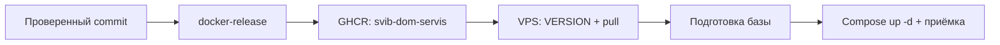

# Выпуск версии и эксплуатация

## Цепочка доставки



Приложение собирается на GitHub, на VPS запускается готовый образ.
На VPS нужен runtime-репозиторий, а не checkout исходников приложения.

## GitHub Actions

Источник: [docker-release.yaml](../../.github/workflows/docker-release.yaml).

Триггеры:

- workflow_dispatch: ручной запуск, выбор ref, обязательный image_tag.
- Push Git-тега release-*.

Обычный push develop не является триггером этого release workflow.

Образ: ghcr.io/koronamedia/svib-dom-servis.
Платформа: linux/amd64.
Сборка получает COMMIT_SHA.

Публикуются:

- Указанный image_tag либо имя release-тега.
- `sha-<полный commit SHA>`.
- develop, если ref — develop.
- latest, только при соответствующем ручном флаге.

Использовать конкретный тег или digest для воспроизводимости.
Не перезаписывать тег уже принятого выпуска.

Перед запуском Actions убедиться, что выбран нужный ref, а изменения находятся на GitHub.
После success проверить summary и соответствие commit/тега на
[странице пакета](https://github.com/koronamedia/Svib-Home-Service/pkgs/container/svib-dom-servis).

Workflow не подключается к VPS и не выполняет production deploy.

## Конфигурация runtime

Основной Compose использует IMAGE_REPO и VERSION.
Эти значения обычно задаются в серверной .env:

```dotenv
IMAGE_REPO=ghcr.io/koronamedia/svib-dom-servis
VERSION=конкретный-тег
```

Общий образ используют init, railsserver, scheduler, websocket, nginx и backup.
PostgreSQL, Redis, Memcached и Elasticsearch имеют отдельные образы и версии.

.env и override принадлежат окружению. Перед переносом проверять домен, TLS/proxy,
порты, тома, COMPOSE_PROJECT_NAME, базу, storage и backup.
Не переносить production .env в dev.

## Новая установка

Полный сценарий с Caddy, HTTPS и первоначальной настройкой находится в
[install.md](../../install.md).
Это один воспроизводимый вариант развёртывания, не утверждение, что текущий сервер владельца использует Caddy.

Особенность чистой установки:
часть DomServis-миграций пропускает создание settings до появления system_init_done.
В install.md есть шаг подготовки после seeds. Не удалять его без исправления и проверки bootstrap в коде.

## Обновление

1. Зафиксировать старый тег и revision runtime.
2. Проверить требования выпуска и миграции.
3. Сделать согласованную копию БД и файлов; проверить доступность копии вне VPS.
4. Изменить VERSION.
5. Скачать образ до остановки приложения.
6. При миграциях остановить пишущие процессы и выполнить init новой версии.
7. Запустить согласованный набор контейнеров.
8. Проверить вход, заявку, проекцию тикета, realtime и push.

Готовые команды — в разделе обновления install.md.
На ином proxy или другом compose-наборе список сервисов адаптируется к фактической конфигурации.

Не делать git pull runtime как обязательный шаг выпуска приложения:
это может одновременно поменять версии инфраструктуры.
Изменения runtime проверяются отдельно.

## Rollback

Старый образ не отменяет миграции.
Если схема изменилась несовместимо, требуется восстановление согласованных БД/файлов
и соответствующего старого образа.

Не выполнять down -v для обновления: это удаляет тома.
При ошибке init не запускать новый backend поверх частично изменённой базы без разбора причины.

## Что зафиксировать в выпуске

- Commit приложения, тег образа и по возможности digest.
- Revision runtime и изменения .env/override без секретов.
- Нужные миграции и одноразовые действия.
- Выполненные тесты и приёмка на тестовом окружении.
- Ограничения и план восстановления.
- Кто и когда проверил production после запуска.

Известные секреты, IP личных серверов и тестовые пароли владельца в документацию не включаются.

[К началу документации](../../developer.md)
